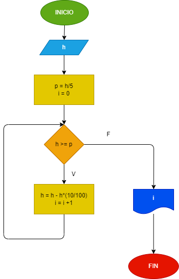

# Ejercicio de rebote
## Una pelota se deja caer desde una altura h, y en cada rebote sube el 10 % menos del anterior. Hhacer el diagrama de flujo y el programa en python, que lea h, y que calcule e imprima en cuál rebote la pelota no alcanza a subir la quinta parte de la altura inicial.
